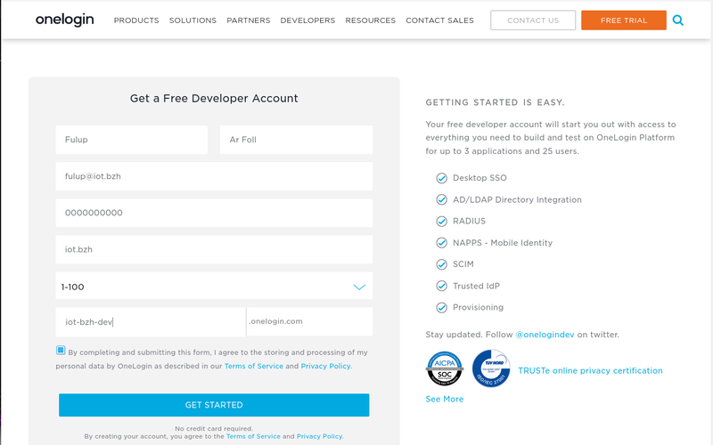
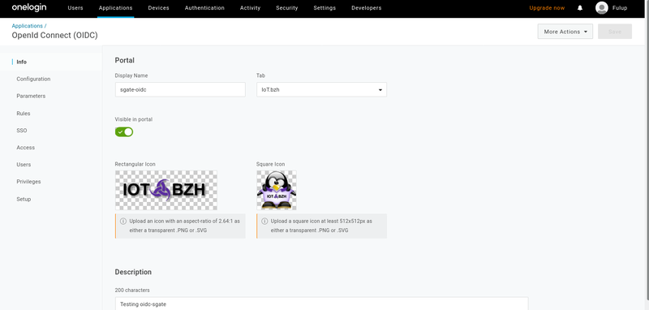
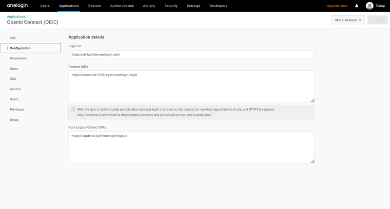
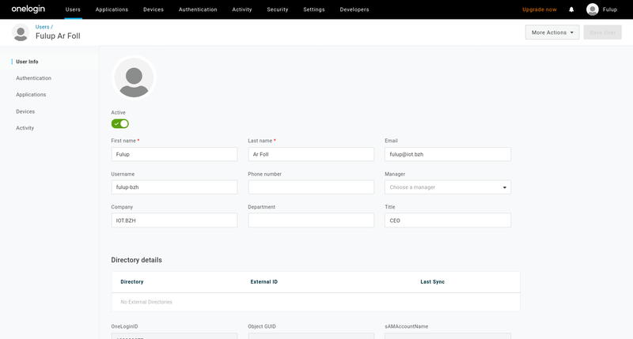
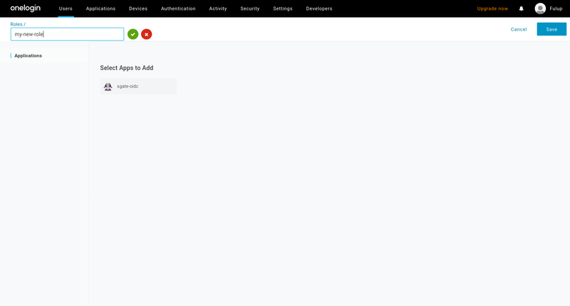
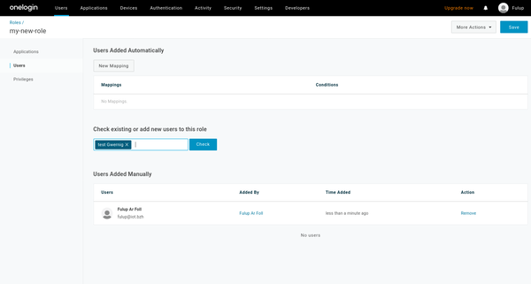
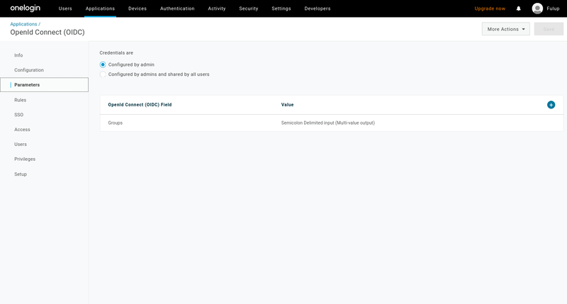

# OneLogin Quick start IDP configuration

OneLogin developer documentation is quite well done, following screenshot should nevertheless help saving time to create your first onelogin mapping with sgate.

**Only steps 1-4 are require** to login your application with sgate in sso with openid-connect. Following steps only describe how to add extra users or map roles to use them as sgate security attributes to test api/alias 'require' permissions.

## 1- request a developer account.

The process is pretty strait forward. After receiving an email to assert you're not a robot, your account is created. Registration creates a public dns hostname as "my-company-name-onelogin.com". You should then connect through that hostname for all your onelogin requests.



## 2- get your application client-id

On order to get a client-id for your application, you should

* connect to your admin console. As said before your url depends on the company name you gave at account creation *(following samples use https://iot-bash-dev.onlogin.com)*

* give a name, logo and few misc info about your application. You may give any name you like, it is only use by onelogin and has no impact on sgate config.



## 3- register your login url

In order your redirected login to be accepted by onelogin IDP, you should register your static urls. Note that you may declare multiple urls which is pretty convenient when shifting from one test scenario to an other. At redirect login time OneLogin will check that your login redirect uri is valid and part of the register list.

```json
    "statics": {
        "login": "/sgate/onelogin/login",
        "logout": "/sgate/onelogin/logout",
        "logo": "/sgate/onelogin/logo-64px.png",
    }
```

Note:

* application login uri should also be declared within the IDP static section of your sgate config in such a way that internal alias and external url match. The login redirect is not an HTML page as such, but a GET/POST endpoint  automatically create by sgate, as a result it neither requirer a dedicate html page, neither requirer an alias map.

* redirect login url should be a valid url for your browser, it does not have to be valid for onelogin idp. As a result https://localhost or https://my.target.local are perfectly acceptable. The only constrain is that redirect url should use https.

* redirect logout is optional and harder to use. The logout url is a direct IDP back channel and the url should be reachable by IDP. As a result IDP initiated logout does not work with system hidden behind a Firewall/NAT *(which is generally the case for embedded devices)*.




## 4- retrieve application clientid/secret

As soon as your application is created under onelogin admin console, your may retrieve its clientid/secret from the application/sso page. Clientid and secret should be copied into the credentials section of your sgate config.

When this is done your should be able to login with openid-connect and onelogin.

```json
    "credentials": {
        "clientid": "1198ce80-9187-0139-6d83-06d14e293211189676",
        "secret": "7a180580642702d7-xxxx"
    },
```


## 5- Add users

In order to test privileges and access control you need multiple users with different security attributes.

Creating a user is simple. Select "user" in the top menu bar and click on "new-user", then enter some detail about the user name,email,...

Note that from this page you cannot add roles/groups (see later section). As we have no external directory any other detail can be safely ignored.




## 6- mapping role on sgate security attributes

In order to test the ```require``` field of the alias/api section you should map some roles with your users. This is not as intuitive as it should, but if you respect following step it should work.

### 6.1 create few roles

Creating a new role is very similar to user creation. From top bar menu select "role" and then click on new role. Unfortunately this part of onelogin UI is not as intuitive as it could. When your arrive on following screen you should:
* enter your role name in the input box
* click on the green button
* click save



### 6.2 add users to a role

Role creation does not ask for any options, the role is just create and you return on role list page. You should select your newly create role from the global list after it has been created.


From this list select your role and click on 'user' and the left menu. You end up on following page. You then should:

* select the user you want to attach to the role
* click on the user name, it should enter into the selection box
* then click 'check' button. This action add a line with username under the check input box
* finally check on "add to this role"

As said before, this is not the most intuitive part of onelogin admin console, but it does the job.



### 6.3 make role as sgate security attributes.

They is not standard schema to return groups/roles from an openid-connect IDP to applications. OneLogin as a dedicate scope that return user groups as part of JWT token-id. To get user roles into returned JWT token-id and use them as sgate security attributes you have to:

* map onelogin token-id groups to sgate security attributess.
* map onelogin groups to roles

To map a special JWT part as sgate security attributes we use the "attrs" key of the sgate config schema section. The onlogin JWT key schema name is "groups".

Note: outside of "attrs" every onlogin schema match default, also to simplify your config you may choose to keep only the "attrs":"groups" within your sgate-config.json.

```json
"schema": {
    "fedid" :"sub",
    "avatar":"picture",
    "pseudo":"preferred_username",
    "name": "name",
    "company": "company",
    "email": "email",
    "attrs": "groups",
},
```
The last thing to do, is to configure onelogin for its returned token-id 'groups' key to hold your user roles. This operation is done in two steps:

* select application from top bar menu
* select your application profile
* click on parameters on left menu (should see following page)
* on this page select "credentials are configured by the admin"



Finaly from the same page click on "Groups". This will open a popup window. As on following image.
* select "User Roles" as default (scroll the list is long)
* select "Semicolon delimited input"
* click on save

You're done. From now when selecting a profile that include "groups" as scope as in following loa=2 config sniped, the return token id will include the list of user's roles.

```json
    "profiles": [
        {"uid":"basic", "loa":1, "scope":"openid profile"},
        {"uid":"roles", "loa":2, "scope":"openid profile groups"}
    ]
```


### 6.4 add require key to your alias/api

In sgate config, create require attributes matching roles name your created.

```json
    {"uid": "api1","uri":"tcp:localhost:1235/test3", "loa":2, "require": ["admin"]},
    {"uid": "api2","uri":"unix:/tmp/spawn-binding/simple", "loa":2, "require": ["user"]}
```

Warning; as said before user's roles are only send when 'groups' scope is requested. In previous sample this is only true with loa=2. As a result any alias/api with an loa=1 will fail to pass require permission.

## 7 Minimalist onelogin config.

A minimalist configuration may look like following one. Check for config chapter for full config options.

```json
{
  "name": "afb-oidc",
  "rootdir":  "/my/sgate/rootdir",
  "https": true,
  "https-cert": "./project/ssl/devel-cert.pem",
  "https-key": "./project/ssl/devel-key.pem",
  "extension": "libafb-sec-gate-oidc-ext.so",
  "binding" : [{"uid": "fedid-api", "path": "fedid-binding.so"}],

  "@extconfig": {
    "sec-gate-oidc": {
        "api": "sgate",
        "globals": {
            "login": "/sgate/common/login.html",
            "register": "/sgate/common/register.html",
            "fedlink": "/sgate/common/fedlink.html",
            "error": "/sgate/common/error.html",
        },

        "idps": [{
            "uid": "onelogin",
            "type": "oidc",
            "credentials": {
                "clientid": "my-onelogin-clientid",
                "secret": "my-onelogin-secret"
            },
            "wellknown": {
                "discovery": "https://iot-bzh-dev.onelogin.com/oidc/2/.well-known/openid-configuration",
            },
            "schema": {
                "attrs": "groups",
            },
            "statics": {
                "login": "/sgate/onelogin/login",
                "logout": "/sgate/onelogin/logout",
                "logo": "/sgate/onelogin/logo-64px.png",
            },
            "profiles": [
                {"uid":"basic", "loa":1, "scope":"openid profile"},
                {"uid":"basic", "loa":2, "scope":"openid profile groups"}
            ]
        }],

        "alias": [
            {"uid": "idp-onelogin" , "url":"/sgate/onlogin", "path":"idps/onelogin" },

            {"uid": "public" , "url":"/public", "path":"public" },
            {"uid": "private", "url":"/private",  "loa":1, "path":"private" },
            {"uid": "confidential", "url":"/confidential", "loa":2, "path":"confidential" },
        ]
    }
  }
}
```