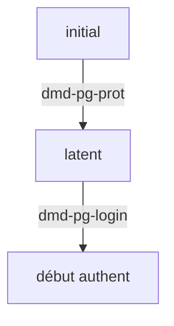

Partie HTTP
===========

Les pages sont servies par le serveur HTTP

L'accès à une page protégée déclenche la séquence d'obtention des crédits

Cette page protégée de déclenchement est appelée page cible (target).
Elle est enregistrée dans la session sous le nom alias.
((AFAIRE: renommer ça en page cible ou juste cible -targetPage ou target-))

L'obtention de crédits se fait par un mécanisme d'authentification X, Y, Z
ou autre.

Le modèle d'obtention des crédits est le modèle OAuth2. Ce modèle permet
l'authentification de l'utilisateur et, via les champs d'application (scope)
donnés au client sec-gate, l'attribution de capacités à l'application.

((ATTENTION en OAuth2, "Scope is a mechanism in OAuth 2.0 to limit an
application's access to a user's account". L'utilisation qui en est faite
par secgate est différente dans le sens où on veut limiter l'utilisateur dans
son accès aux applications controlées par secgate. A DISCUTER))

Quand l'authentification est faite, le mécanisme X, Y, Z ou autre,
recupère un identifiant de l'utilisateur propre au mécanisme.

Le couple (mécanisme, identifiant-propre-au-mécanisme) correspond à ce qui
sera enregistré dans la base de données dans la table 'fed_keys'.

En utilisant cet identité authentifiée, et ses codes d'accès (identifiant
d'application et secret d'application), sec gate retrouve les éléments
associés à l'identité: nom, entreprise, mail, pseudo, avatar, ...

Ces éléments correspondent à ce qui sera peut-être enregistré dans la table 'fed_users'.

Diagramme d'états

états:

- initial: état initial
   - session vide

- latent: une page protégée est demandée
   - session avec une page cible (alias TODO renommer)

- debauth: un processus d'authentification a commencé
   - session avec une page cible
   - session avec un etat cible

transitions:

- dmd-pg-prot: demande une page protégée
   - ajoute la page cible à la session

- dmd-pg-login: demande la page de login d'un idp (sans 'state')
   - crée un état et l'associe à la session comme état cible

