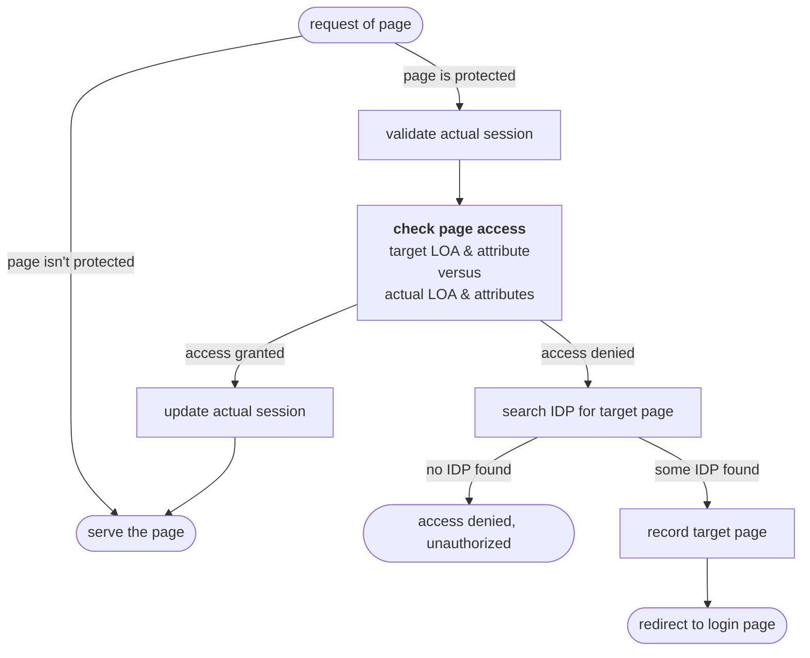
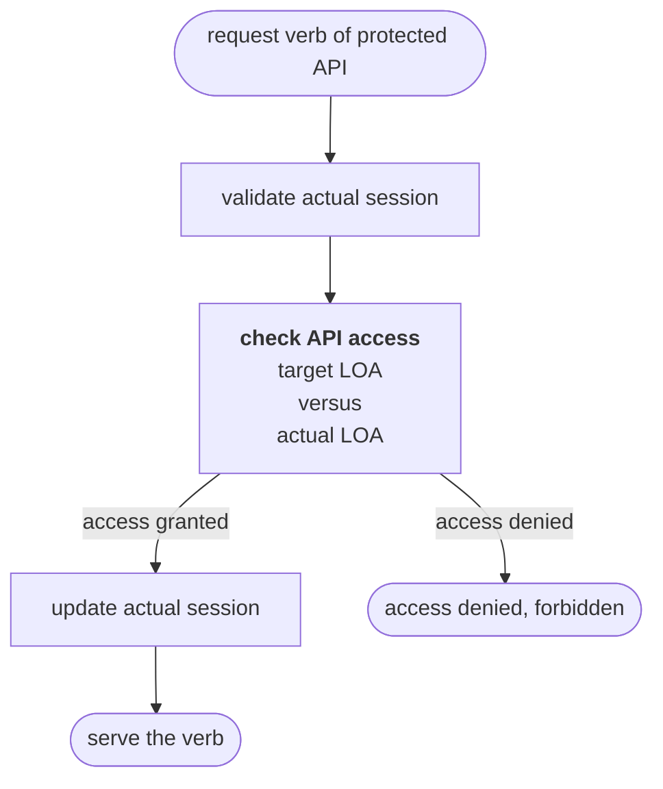
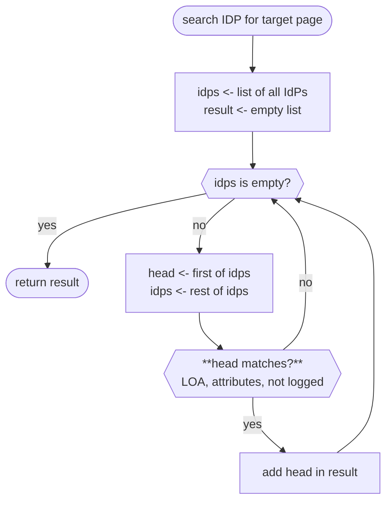
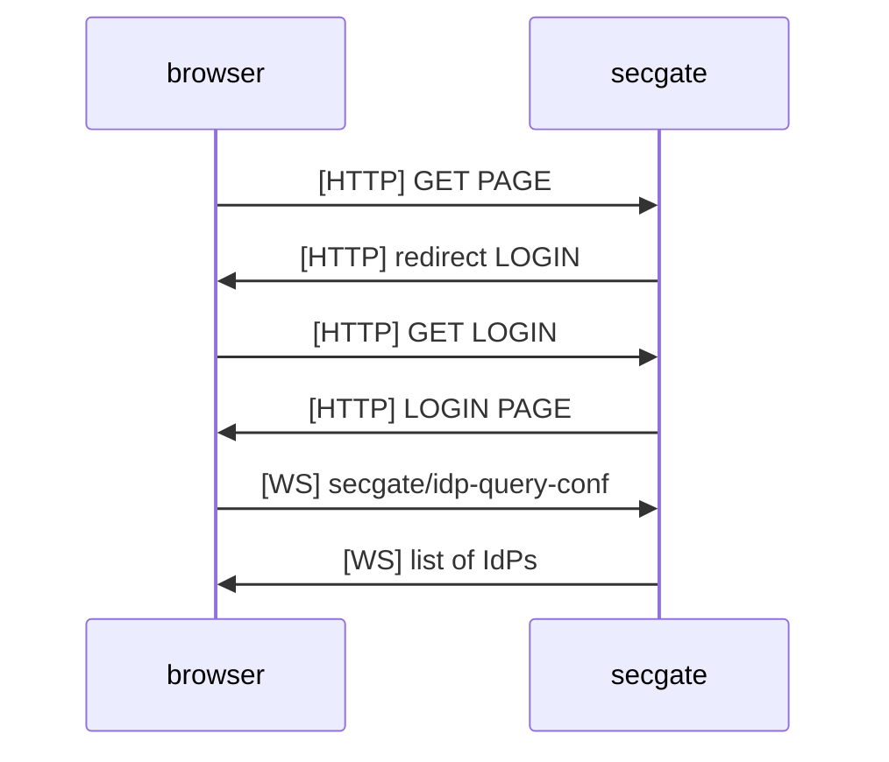
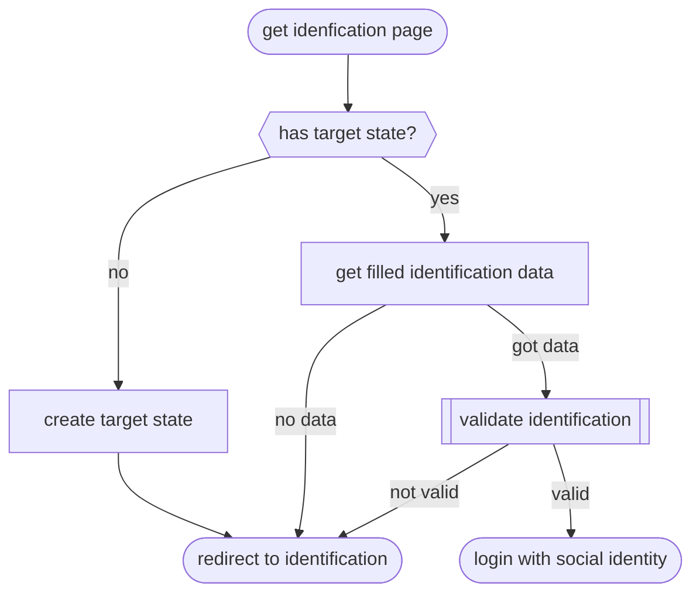
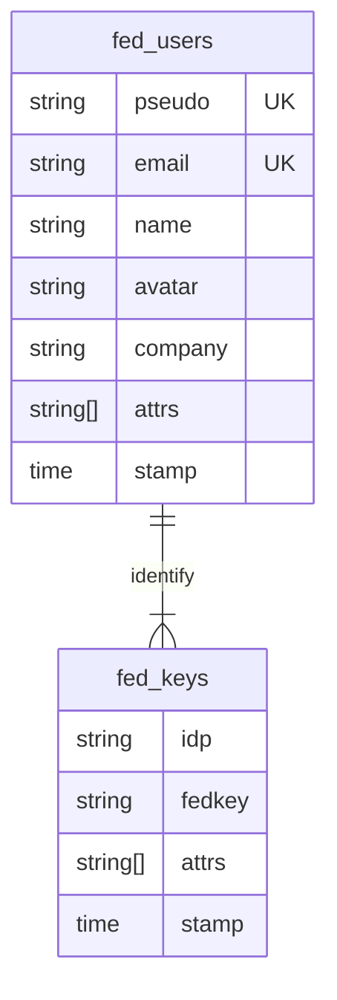
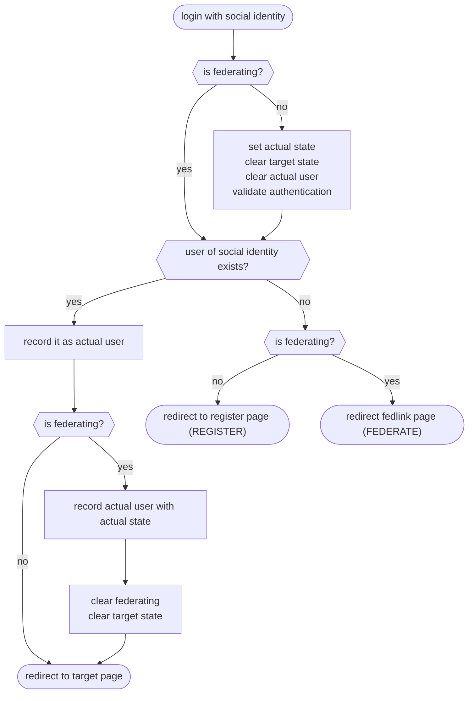
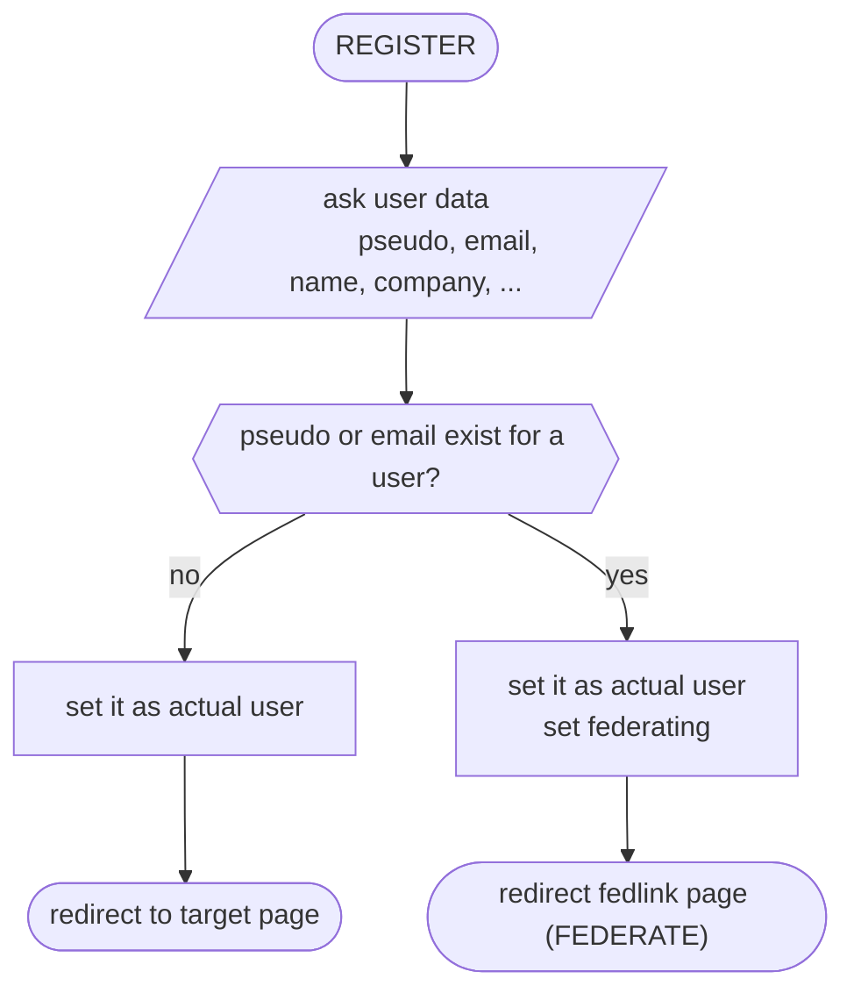
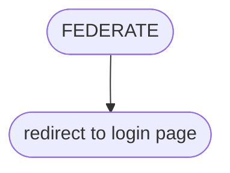
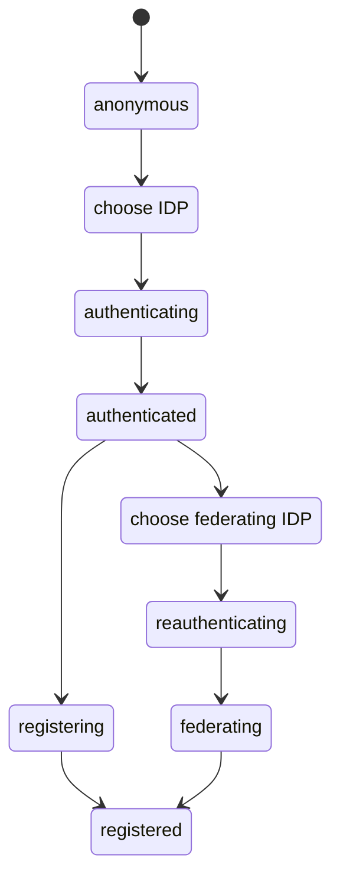

# rapport du 4/2/2026

Ce rapport contient un bilan avec remarque puis une description des mécanismes internes

## bilan des travaux de rénovation fait du 4/12/2025 au 4/2/2026

Avant de lister les travaux, voici mon sentiment sur le produit.

L'objectif de ce produit n'est sans doute pas d'être opérationnel mais
plutôt de démontrer une faisabilité ainsi que la mise en oeuvre de concepts
avancés des extensions du binder.

La démonstration de la faisabilité est réussie. Toutefois, en l'état
sec-gate-oidc ne peut être utilisé que dans des preuves de concept, pas
dans des produits.

Les travaux faits on permis de mieux comprendre le fonctionnement interne
de sec-gate-oidc, de l'améliorer, de le décrire.

Selon moi, le sec-gate-oidc souffre encore de nombreux maux que le temps
ne m'a pas permis de corriger:

- Il y a un grand mélange entre la partie HTTP+CGI et la partie HTTP+JS+API
  avec une gestion d'état interne peu lisible car dispersée

- L'identification uniquement par API serait à supprimer parce qu'elle
  n'est pas aboutie et parce que l'intervention d'un utilisateur est
  le cadre privilégié voire unique de sec-gate-oidc

- La fédération n'est pas nécessaire dans le cadre d'un produit, voire
  elle est inutile. Mais elle n'est pas encore débrayable.

- L'ergonomie du démonstrateur est rudimentaire.

Je propose d'arreter les travaux de rénovation et d'entamer un travail
de réflexion sur quel produit d'authentification et contrôle des droits
veut-on propulser?

A titre personnel, je propose de se concentrer sur un produit HTTP+CGI
(RESTful) d'ergonomie simple et pouvant intégrer ou non la fédération d'identité.

Les raisons pour lesquelles je propose d'exploiter une conception sans javascript
sont: simplicité du client, unicité de l'interface, implémentation des algorithmes
seulement dans le service, testabilité par CURL.

La mise en oeuvre de cette technologie implique la réalisation coté serveur d'un mini
gérateur de pages HTML. A cette fin, peut être l'utilisation de json-c + moustache
sera suffisante. Si c'est le cas, rp-lib-util et afb-libhelper sont à envisager comme
librairie d'intégration.

### travaux faits

- Reprise de sec-gate-fedid-binding
   - Améliorations diverses
   - Documentation
   - Implémentation des convertisseurs de données

- Réorganisation du code
   - Reprise de l'arborescence des fichiers

- Amélioration de la sous librairie CURL
   - Fixe de problèmes
   - Finalisation de l'intégration asynchrone

- Création d'un objet session unique attaché aux sessions
  du binder: efficacité, préparation du découplage des ID de session
  et d'état

- Création d'objets etat d'identification attachés aux sessions,
  deux objet, un cible (ou encours d'authetification), un actuel
  (ou effectif)

- Factorisation de code commun dans oidc-idp afin de gérer les pages
  de login

- Utilisation de POST pour les login ldap et pam

- Utilisation des convertisseurs de données

- Sont bien testés les IdP github, ldap, pam

- Utilisation de valgrind pour améliorer la gestion mémoire

- Formattage avec clang format

### reste à faire

- sec-gate-fedid-binding
   - Validation des paramètres passés à SQL
   - Réutiliser les instructions préparées (prepared statement) SQL au lieu de toujours les recréer

- Les idp pcsc et oidc ne sont pas encore testés

- Idéalement il faudrait dissocier l'UUID de session du binder de l'identifiant d'état
  utilisé en OAuth ou OIDC

- Intégration avec cynagora, il existe un projet de gestion de cynagora par "capabilités",
  sec-cynagora-binding, dont la réalisation a été motivée par son intégration à sec-gate-oidc.
  Cette intégration n'a jamais eu lieu.

- les API internes du module CURL sont à améliorer

- les interfaces internes des plugin idp sont à améliorer

- pas mal de cas d'erreurs ne sont pas gérés correctement

## controle HTTP

La protection des pages se fait par exploitation du mecanisme interne de gestion des
requêtes HTTP. Ce mécanisme permet de créer des filtres de gestion des accès dont
l'ordre d'évaluation est géré par un simple mécanisme de priorités.

Ainsi, l'accès à une page protegée est géré en intercalant un filtre de priorité
élevée qui contrôle si l'accès à la page est possible ou non.

Si l'accès est possible, le filtre ne fait rien et autorise l'évaluation des filtres
de priorité plus faible, dont celui servant la page.

Si l'accès n'est pa possible, le filtre agit en conséquence et retient l'évaluation
des filtres de moindre priorité.

L'accès à une page protégée déclenche la séquence d'obtention des crédits

Cette page protégée de déclenchement est appelée page cible (target).
Elle est enregistrée dans la session sous le nom de "Target Page".

Cette fonction est réalisée dand les fichier `lib/oidc-alias.c`, fonction
`aliasCheckReq` et correspond au diagramme ci-dessous:

## controle API

Les API sont protégées de manière analogue mais différentes. Les API
protégées sont importées l'ensemble des API priv&es du binder.
L'ensemble des API publiques reçoit une API du nom exporté mais dont
l'implémentation controle le droit d'accès à l'API, relayant l'invocation
à l'implémentation réelle (et privée) ou refusant l'accès, selon le cas.

Cette fonction est réalisée dand les fichier `lib/oidc-apis.c`, fonction
`apisCheckReq` et correspond au diagramme ci-dessous:

## authentification

L'obtention de droits d'accès (aux pages ou aux API)  se fait par un mécanisme
d'authentification fournit par des IdP (fournisseur d'identité).

Les IdPs sont connus par la configuration de sec-oidc-gate. De même les
pages et APIs protégées sont décrites par configuration.

Selon les critères de la configuration, l'accès à une page ou API
peut n'être disponible que pour un nombre restreint d'IdP.

Ainsi, les IdP doivent être proposés selon les exigences des pages (ou API)
à acceder.

La méthode d'obtention des IDP pour leur présentation est comme suit:

Comme on peut le voir, la liste des IDPs est fournit par le biais d'un appel
websocket au verbe secgate/idp-query-conf et est récupérée en format JSON par le
navigateur client.

Cette façon de faire exige que le client HTTP possède un interpréteur javascript.
C'est une limitation minuscule. Mais on peut néanmoins se poser la question et
fournir une page soit statique soit générée dynamiquement mais coté serveur
sont des options tout à fait cohérentes.

La sélection de l'IdP, par l'utilisateur du navigateur, produit le
chargement de la page ilocale d'identification de l'IdP.
Mais deux cas peuvent se produire:

- l'IdP est totalement géré en local (LDAP, PAM, SmartCard). Dans ce
  cas, la page d'identification est locale.

- l'IdP est exploite un service distant (OIDC, GITHUB, ...). Dans ce
  cas, la page d'identification déclenche le processus mais elle redirige
  vers une page du service tiers.

Dans tous les cas, le processus d'identification commence par créer
une instance de `oidcState` dont le rôle est de gérer les identifications
(identification primaire et identification secondaire de fédération).

Cette instance est associée à la session sous la désignation de `Target State`.
Une fois validée, authentifiée, l'identification de 'Target State' devient
l'identification actuelle ou l'identification de fédération selon l'état courant.

La mise en place de ce processus identification est typiquement réalisé
par les fonctions `idpRedirectLogin`, `idpStdRedirectLogin`, `idpOnLoginPage`
et `idpOnLoginRequest` de `lib/oidc-idp.c`.

Le processus est globalement le suivant:

Le modèle d'obtention des crédits est le modèle OAuth2. Ce modèle permet
l'authentification de l'utilisateur et, via les champs d'application (scope)
donnés au client sec-gate, l'attribution de capacités à l'application et
à l'utilisateur de l'application.

((ATTENTION en OAuth2, "Scope is a mechanism in OAuth 2.0 to limit an
application's access to a user's account". L'utilisation qui en est faite
par secgate est différente dans le sens où on veut limiter l'utilisateur dans
son accès aux applications controlées par secgate. A DISCUTER))

((ATTENTION, il n'est pas testé si après authentification, un attribut n'est
pas disponible, que se passe-t-il ? A vérifier))

## identité

Quand l'authentification est faite, sec-gate est en posséssion d'un identifiant
unique de l'identité propre à l'IdP utilisée. Le couple IdP plus identifiant
est propre à un utilisateur. Cette donnée, ce couple, est associé dans sec-gate
à une identité sociale représentée par les instances de la structure `fedSocialRawT`.

Conceptuellement, l'identité sociale est liée à l'identité réelle (ou virtuelle)
d'un acteur du système. Cette identité réelle peut être connue de plusieurs IdPs.
Par exemple, la même personne peut avoir un compte dans github et dans gitlab.

On a donc une relation de 1 à N entre une identité réelle et les identités sociales.
Les identités réelles sont représentées par les instances de de la structure `fedUserRawT`.

Les identités sociales et réelles sont gérées en interne par le sous composant
sec-gate-fedid-binding qui gère une base de données des identités.

La base de données gérée par sec-gate-fedid-binding est décrite par le schéma ci-dessous:

Le couple (idp, identifiant unique) correspond à ce qui
sera enregistré dans la base de données dans la table `fed_keys` et
représenté en interne par les instances de `fedSocialRawT`.

Les informations de l'identité réelle: nom, mail, pseudo, ...
sont enregistrés dans la table `fed_users` et représentés par
les instances de `fedUserRawT`.

((ATTENTION, l'obtention d'une identité réelle n'est pas nécessaire
pour délivrer et gérer les droits d'accès. Il est donc tout à fait possible
de créer un service sec-gate-oidc qui serait configurer pour travailler
sans identité réelle ni fédération. On peut même se demander pourquoi
il faut qu'il y ait identité réelle et fédération))

## fédération

Une fois l'identité sociale (celle d'un IdP) obtenue, le système
sec-gate-oidc veut la rattacher à une identité réelle.

Le diagramme ci-dessous montre le processus suivi lors de cette étape.
Ce processus est essentiellement codé dans le fichier `lib/oidc-login.c`.

The straight flow is when the social identity exists and federating is false.
In that case, after identification, the the current state is adapted to make
autheticated identity as actual identity and the target page is served
(if possible).

The less straight flow is when the social identity doesn't exist and federating
is false. In that case, the flow is redirected to the register page, starting
the register process.

Other cases are discussed later, after description of registering.
The register process is mostly done in HTML+JS et .

((ATTENTION, il y a ici mélange entre action faites par API et actions faites
par CGI. Ici, l'enregistrement est fait par le biais de l'API de service du
fichier `extension/oidc-idsvc`. C'est en dehors du sous composant `lib/...`.
De fait, il y a non unicité entre le processus d'enregistrement dans oidc-idsvc
et celui de oidc-login. Le redirect par exemple doit être géré en JS et non par
des codes HTTP.))

It is described here:

Quand l'utilisateur réel, identifié par son pseudo ou son email, n'existe pas déjà,
le processus enregistre la nouvelle identité associée à l'identité sociale actuelle.

En revanche, si l'identité existe déjà, on est dans le cas de la fédération d'identité,
il faut associer à la nouvelle identité sociale l'identité réelle déjà connue
dans la base de données. Mais comme cette identité réelle est déjà associée
à un ou des IdPs, l'association n'est possible que si l'utilisateur peut prouver
qu'il peut s'identifier sur au moins un des IdPs liés à l'identité réelle cible.

Ce processus de fédération est très simple, il s'agit de rediriger vers la page
de login. Cette page propose une liste d'IdP pour s'authentifier. La subtilité ici
est que (1) la liste des IdP correspond aux IdPs déjà liés à l'utilisateur actuel
et (2) le drapeau de fédération (federating) est actif.

Ceci est décrit ci-dessous:

## session

La gestion de l'état du service sec-gate-oidc est faite par session.
Une session au sein de afb-binder est une instance nommée par un UUID
qui a une durée de vie limitée dans le temps. Lorsque le binder est accédé par
un navigateur, il produit un cookie permettant d'identifier la session.
Ceci permet de fournir un service à état à un navigateur qui par défaut est
en mode déconnecté sans avoir à gerer l'état par l'application (REST).

((ATTENTION, l'UUID de la session est aussi utilisé entant que NONCE et
que STATE dans les échanges open-id ou oauth. Idéalement, il faudrait
fournir des identifiants indépendants))

L'extension sec-gate-oidc enregistre dans la session un objet `oidcSession`
servant à gérer l'état du service pour une session cliente.

L'objet session contient les informations suivantes:

- *targetPage*: page cible ayant déclenché le mécanisme d'authentification
  et qui sera à afficher quand ce dernier aura réussi

- *targetState*: information sur l'authentification en cours de déroulement

- *actualState*: information sur l'identification actuelle validée et active

- *user*: information sur l'identité réelle actuelle selon sec-gate-fedid-binding

- *event*: objet pour envoyer des évènements aux abonnés

- *nextCheck*, *endValid*: temps pour la validation de la session active afin
  de détecter son expiration

Diagramme d'états de l'authentification et de la session

Les données de session dépendent de l'ata de l'authentification:

| state            | targetstate | actualstate | user | federating |
|------------------|-------------|-------------|------|------------|
| anonymous        |             |             |      |            |
| choose IDP       |             |             |      |            |
| authenticating   |    yes      |             |      |            |
| authenticated    |             |   yes       |      |            |
| registering      |             |   yes       |      |            |
| rechoose IDP     |             |   yes       | yes  |   yes      |
| reauthenticating |    yes      |   yes       | yes  |   yes      |
| federating       |    yes      |   yes       | yes  |   yes      |
| registered       |             |   yes       | yes  |            |

## état

`targetState` et `actualState` sont des instances de la structure `oidcStateT`.
Ils contiennent les informations suivantes:

- *session*: la session cible

- *profile*: le profil cible

- *idp*: l'IdP cible

- *fedSocial*: l'identité sociale après authentification

- *fedUser*: les info d'identité réelle selon l'IdP après authentification

- *authorization*: le code d'accès de sécurité de l'IdP après authentification

- *hreq*, *wreq*: objet de requête courante lors du processus d'authentification
  utilisé pour envoyer une réponse d'authentification

