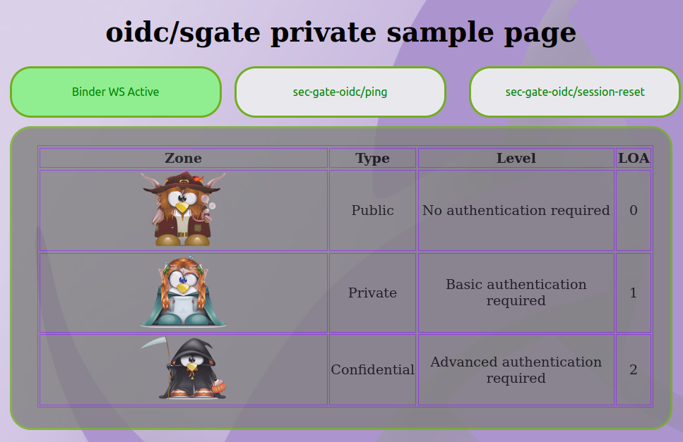
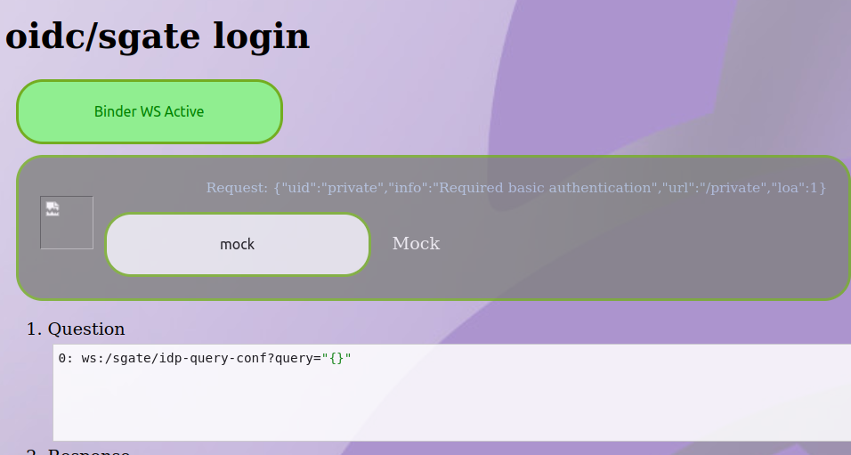
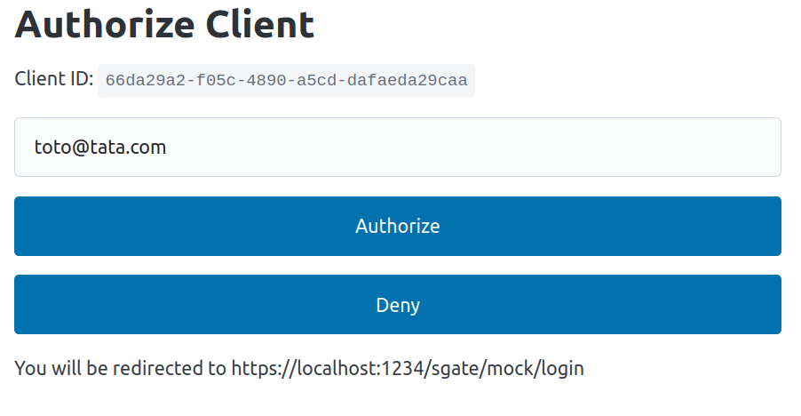
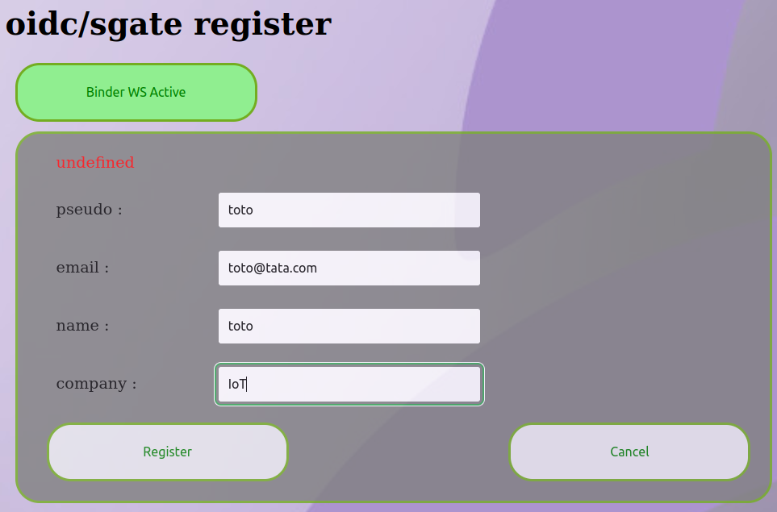

# How to test this extension ?

The goal is to have a secure gateway "in front" of other binders and that gives access or not to apis.

We will test with a binder that exposes the "helloworld" api on port 1235 and that requires an LOA of 1.

We will use a "mock" OIDC provider for test purposes, but this could also work with other OIDC providers (in the end, among Github, LinkedIn and Google, only Google works).

We will configure the OIDC to provide an LOA of 1

## Mock OIDC provider

Install it:
```
pipx install oidc-provider-mock
```

Run it:
```
oidc-provider-mock
```

This will create a server on localhost:9400.

Now you can register your application:

```
$ curl -XPOST localhost:9400/oauth2/clients -H "Content-type: application/json" -d '{"redirect_uris": ["https://localhost:1234/sgate/mock/login"]}'
{
  "client_id": "xxxxxxx-f05c-4890-a5cd-dafaeda29caa",
  "client_secret": "xxxxxxyyyyyyyyyy",
  "grant_types": [
    "authorization_code",
    "refresh_token"
  ],
  "redirect_uris": [
    "https://localhost:1234/sgate/mock/login"
  ],
  "response_types": [
    "code"
  ],
  "token_endpoint_auth_method": "client_secret_basic"
}
```

Note the "client_id" and "client_secret" fields returned.

### Binding configuration

```
{
    "name": "sec-gate-oidc",
    "tracereq": "none",
    "verbose": 255,
    "port": 1234,
    "https": true,
    "https-cert": "../conf.d/project/ssl/devel-cert.pem",
    "https-key": "../conf.d/project/ssl/devel-key.pem",
    "extension": "./package/lib/libafb-sec-gate-oidc-ext.so",
    "roothttp": "../conf.d/project/htdocs",
    "rootdir": "../conf.d/project/htdocs",
    "binding": [
        {
            "uid": "fedid-api",
            "path": "/home/hugo/src/sec-gate-fedid-binding/build/src/sec-gate-fedid-binding.so",
            "config": {
                "dbpath": "/var/tmp/fedid-oauth2.sqlite"
            }
        }
    ],
    "@extconfig": {
        "sec-gate-oidc": {
            "api": "sgate",
            "info": "oidc secure gate demo config",
            "globals": {
                "info": "Relative location to HTML pages",
                "login": "/sgate/common/login.html",
                "register": "/sgate/common/register.html",
                "fedlink": "/sgate/common/fedlink.html",
                "error": "/sgate/common/error.html",
                "timeout": 600
            },
            "idps": [
                {
                    "uid": "mock",
                    "type": "oidc",
                    "info": "Mock",
                    "credentials": {
                        "clientid": "<CLIENT_ID>",
                        "secret": "<CLIENT_SECRET>"
                    },
                    "wellknown": {
                        "lazy": true,
                        "discovery": "http://localhost:9400/.well-known/openid-configuration",
                        "authent": "client_secret_basic"
                    },
                    "statics": {
                        "login": "/sgate/mock/login",
                        "logo": "/sgate/linkedin/linkedin_logo.png",
                        "timeout": 600
                    },
                    "profiles": [
                        {
                            "uid": "basic",
                            "loa": 1,
                            "scope": "email"
                        }
                    ]
                }
            ],
            "apis": [
                {
                    "uid": "fedid",
                    "info": "embedded social federated user identity svc",
                    "loa": 0,
                    "uri": "@fedid"
                },
                {
                    "uid": "helloworld",
                    "uri": "tcp:localhost:1235/helloworld",
                    "loa": 1,
                    "require": [
                        "email"
                    ],
                    "lazy": 0
                }
            ],
            "alias": [
                {
                    "uid": "idp-common",
                    "url": "/sgate/common",
                    "path": "idps/common"
                },
                {
                    "uid": "idp-mock",
                    "url": "/sgate/mock",
                    "loa": 0,
                    "path": "idps/mock"
                },
                {
                    "uid": "public",
                    "info": "Anonymous access allowed",
                    "url": "/public",
                    "path": "public"
                },
                {
                    "uid": "private",
                    "info": "Required basic authentication",
                    "url": "/private",
                    "loa": 1,
                    "path": "private"
                },
                {
                    "uid": "confidential",
                    "info": "Required teams authentication",
                    "url": "/confidential",
                    "loa": 2,
                    "path": "confidential"
                },
                {
                    "uid": "admin",
                    "info": "Required admin security attribute",
                    "url": "/admin",
                    "loa": 1,
                    "path": "admin",
                    "require": [
                        "wheel",
                        "iotbzh",
                        "sudo"
                    ]
                }
            ]
        }
    }
}
```

## Google

Go to https://console.cloud.google.com/projectselector2

=> Create project

=> API & services => credentials

=> Create credentials => OAuth client ID

=> Configure Consent Screen

=> Create Oauth client ID
  - Application type: Web application
  - Name: whatever
  - **Important** Add Authorized redirect URIS: https://localhost:1234/sgate/google/login
  
=> Create

Then **copy** Client ID and client secret

### Binding configuration

Just change the "idps" part:

```
                {
                    "uid": "google",
                    "type": "oidc",
                    "info": "Google",
                    "credentials": {
                        "clientid": "<CLIENT_ID>",
                        "secret": "<CLIENT_SECRET>"
                    },
                    "wellknown": {
                        "lazy": true,
                        "discovery": "https://accounts.google.com/.well-known/openid-configuration",
                        "authent": "client_secret_basic"
                    },
                    "statics": {
                        "login": "/sgate/google/login",
                        "logo": "/sgate/linkedin/linkedin_logo.png",
                        "timeout": 600
                    },
                    "profiles": [
                        {
                            "uid": "basic",
                            "loa": 1,
                            "scope": "email"
                        }
                    ]
                }
```

## Test workflow

Launch an afb-binder with one of the provided configuration files (either mock OIDC or Google) on port 1234.

Then point a browser to https://localhost:1234.

You should see the gateway main page:


Then click on the character in the middle for LOA=1 (/private), you will arrive on a page that lists the OIDC providers available:


Then click on the provider you have configured before, you will be redirected to the OIDC provider authentication page.
For the mock, use whatever email you like and click "Authorize".


The first time you will then be redirected to a "registration" page. This is because the sec-gate-oidc bindings relies on a local database of identities.
(IMHO, this database should be prepared beforehand to make sure the authenticated user is legitimate on the local platform). Enter whatever you want but make sure the "email" field matches the email you use to auhtenticate with the OIDC provider.


And now you should be redirected to the /private initially asked for ! This should be where calls to "protected" APIs are possible.

You can test with a Javascript console in debug tools (F12 in Firefox):
```
callbinder("helloworld", "hello", "me")
```

This should correctly call the helloworld api and return "hello me".

Test the same call in an unsecure context (LOA=0), and it should fail.

TBC: is it possible to test with afb-client + session uuid ?

## Bugs

Plusieurs choses ne fonctionnent pas actuellement:
- l'implémentation de l'extension a un souci avec sa manière d'utiliser la libcurl (https://redmine.ovh.iot/issues/8066) Le mode "non-bloquant" ne fonctionne pas bien. La branche @mhugo/wip du code force l'utilisation du mode bloquant pour que cela fonctionne au moins avec mock ou Google
- avec les configurations listées ici, la dernière étape du test (appeler helloworld en javascript) ne fonctionne pas: une fois sur 2, l'appel échoue avec un "server hung up" et l'autre fois sur 2, l'appel est émis, mais sans jamais revenir
- l'api helloworld n'est pas listée par le monitoring
- remplacer "tcp:localhost:1235/helloworld" par "unix:@helloworld" (en ayant au préalable lancé le binder helloworld avec --ws-server=unix:@helloworld) fait que l'api helloworld est bien visible depuis la sec gate. Les appels à helloworld fonctionnent, mais ils sont toujours acceptés, même quand aucune authentification n'a été faite !


